### 垃圾的网上论坛
> 一个使用JSP+Servlet+JavaBean+DAO+JDBC+Oracle开发的垃圾的网上论坛
### 1.网上论坛需求分析
> 这里主要实现网上论坛的两个基本模块，即登录注册模块和留言板模块。登录注册模块主要包括用户登录、注册、忘记密码，留言板模块主要包括发表留言、回复留言、修改留言、删除留言、显示留言等功能。

- 用例图如图1-1所示。
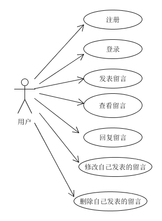
图1-1 网上论坛用例图
### 2.数据库设计
#### 2.1数据库概念结构设计
> 通过对网上论坛中数据及数据处理过程的分析，抽象出用户信息（user_info）、留言信息（guestbook）、回复信息（reply）3个实体，ER图如图2-1所示。

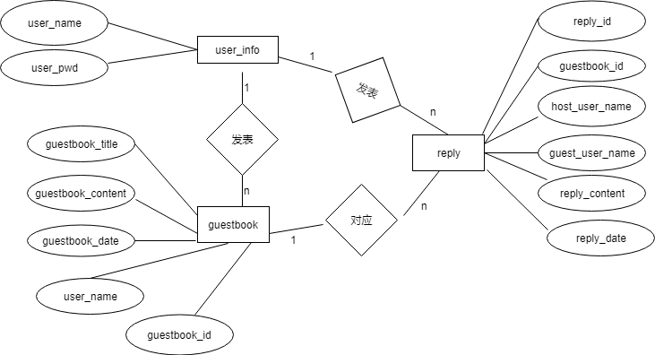
图2-1 网上论坛ER图
#### 2.2数据库逻辑结构设计
> 根据网上论坛ER图，设计出该系统的9个关系表，分别为user_info（用户信息）、guestbook（留言信息）、reply（回复信息）。表结构及其约束情况见表2-2至表2-4。

- 表2-2 user_info表结构及其约束

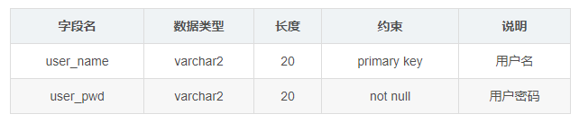

- 表2-3 guestbook表结构及其约束
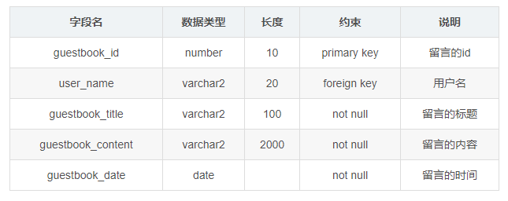

- 表2-4 reply表结构及其约束
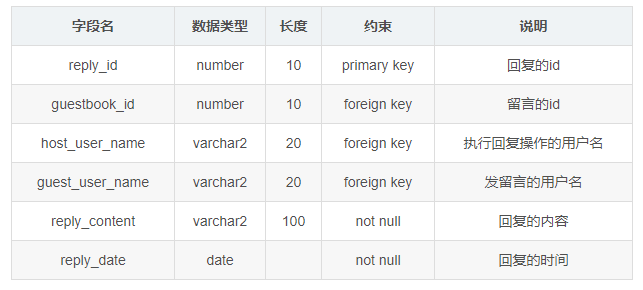

- 表之间的关系图见图2-2：
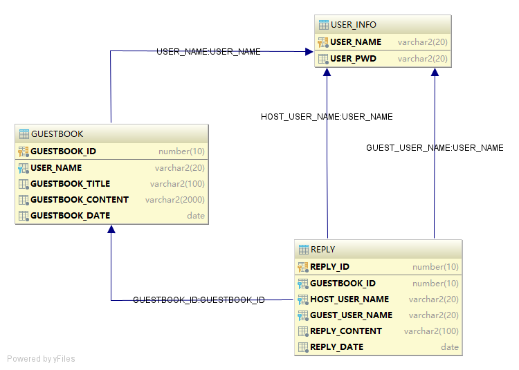
图2-2 表之间的关系图

#### 2.3序列设计
> 为了方便产生留言的id、回复的id，在数据库中分别用下列序列产生相应编号。
- guestbook_id_seq：产生留言的id，起始值为2019070400，步长为1，不缓存，不循环。
- reply_id_seq：产生回复的id，起始值为2019070600，步长为1，不缓存，不循环。

### 3.网上论坛数据库实现
#### 3.1表的创建
```sql
create table user_info (
user_name varchar2(20) primary key,
user_pwd varchar2(20) not null);

create table guestbook (
guestbook_id number(10, 0) primary key,
user_name varchar2(20) not null references user_info(user_name),
guestbook_title varchar2(100) not null,
guestbook_content varchar2(2000) not null,
guestbook_date date not null);

create table reply (
reply_id number(10, 0) primary key,
guestbook_id number(10, 0) not null references guestbook(guestbook_id),
host_user_name varchar2(20) not null references user_info(user_name),
guest_user_name varchar2(20) not null references user_info(user_name),
reply_content varchar2(100) not null,
reply_date date not null);
```
#### 3.2序列的创建
```sql
create sequence guestbook_id_seq start with 2019070400 increment by 1 nocache;
create sequence reply_id_seq start with 2019070600 increment by 1 nocache;
```
### 4.网上论坛主界面设计
#### 4.1登录与注册界面设计
> 用户需要登录过后才可以使用发表留言等其他功能。用户登录界面如图4-1所示。用户在登录之前需要先进行注册，注册界面如图4-2所示。

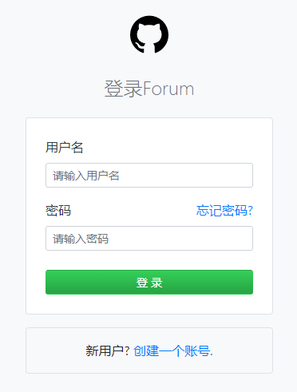
<br>图4-1 用户登录界面

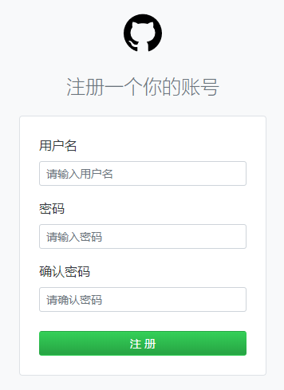
 <br>图4-2 用户注册界面
 
 #### 4.2 发表留言界面设计
> 登录成功后跳转到发表留言页面，在发表留言页面输入留言标题和内容，点击发表按钮，即可发表留言。发表留言界面如图4-3所示。

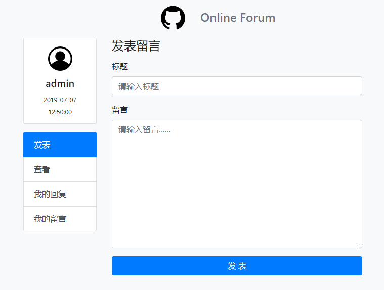
<br>图4-3 发表留言界面

#### 4.3查看留言界面设计
> 每一个用户都可以查看到所有的留言，并且也可以回复所有的留言，但是只能修改和删除自己发表的留言。查看留言部分界面如图4-4所示。

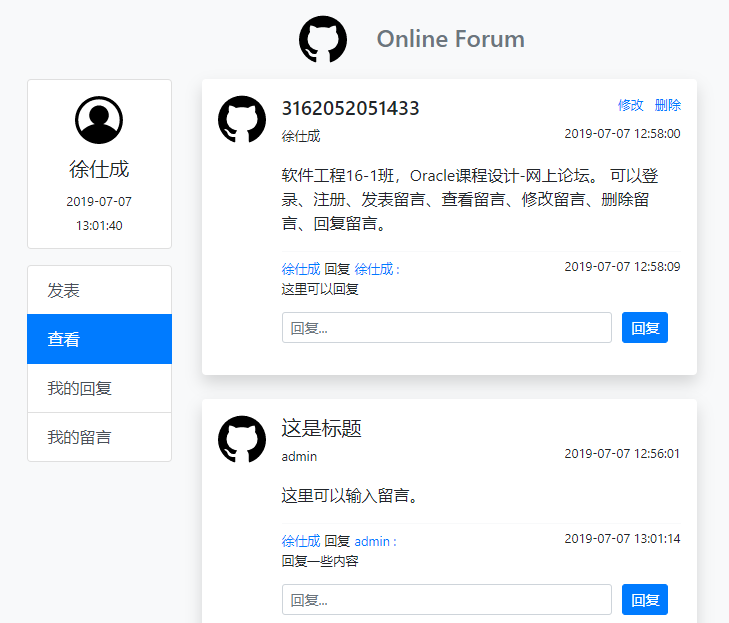
<br>图4-4 查看留言界面

#### 4.4修改留言界面设计
> 每个用户在查看留言页面可以看到在自己发表的留言的右上角有一个修改链接，点击修改，可跳转至修改留言界面，在原有内容上进行修改，点击修改按钮即可。每个用户只能修改自己的留言，不是自己发表的留言不会出现修改链接，无法修改。修改留言界面如图4-5所示。

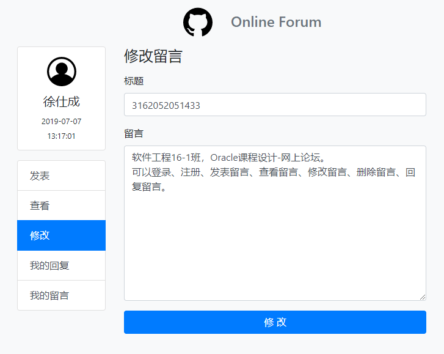
<br>图4-5 修改留言界面

### 5.网上论坛主要功能实现
#### 5.1网上论坛设计概述
> 本系统采用`JSP`+`Servlet`+`JavaBean`+`DAO`+`JDBC`+`Oracle`+`Bootstrap`+`Layer`+`HTML`+`CSS`+
`JavaScript`+`EL`+`JSTL`等技术开发，使用`IntelliJ IDEA`、`Tomcat`、 `Database Configuration Assistant`、`sqldeveloper`、`Chrome`、`Sublime Text`等工具进行开发。
使用的开发环境以及开发工具的版本如表5-1所示。

- 表5-1 开发环境以及开发工具
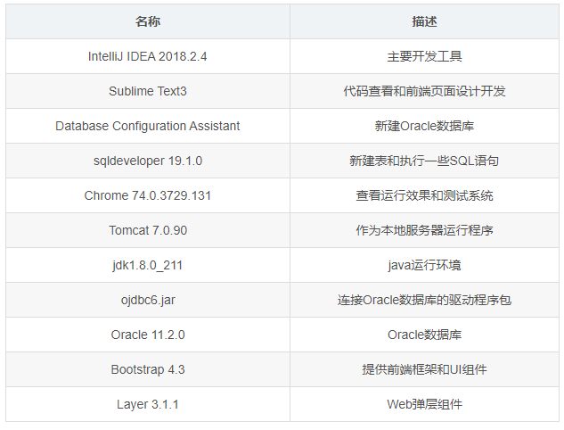
<br>表5-1 开发环境以及开发工具

- 架构图如图5-1所示：
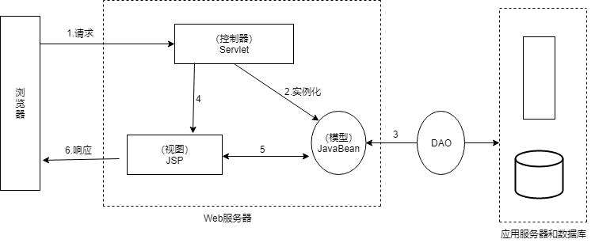
<br>图5-1 架构图

#### 5.2系统目录结构
- 系统的目录结构如下：
```
//java代码部分
.src
│  db.properties  //连接数据库的配置文件
│
├─beans
│      GuestBook.java  //对应guestbook表，包含该表中字段的set和get方法
│      Reply.java  //对应reply表，包含该表中字段的set和get方法
│      UserInfo.java  //对应user_info表，包含表中字段的set和get方法
│
├─dao
│      GuestBook_dao.java   //进行留言的增删改查
│      Register_dao.java    //添加用户
│      Reply_dao.java   //进行回复的添加和查找显示
│      SearchGuestBook_dao.java   //通过guestbook_id查找留言，修改留言是用到
│
├─dbc
│      JdbcUtil.java   //数据库的连接和释放资源工具
│
└─servlets
        DeleteForumServlet.java   //实现删除留言操作
        ForumServlet.java   //实现发表留言操作
        LoginServlet.java   //实现登录操作
        LookForumServlet.java   //实现查看留言操作
        ModifyForumServlet.java   //实现修改留言操作
        RegisterServlet.java   //实现注册操作
        ReplyForumServlet.java   //实现回复操作
        ToModifyForumServlet.java  //协助实现修改留言操作
//web部分的目录结构
.web
│  forum.jsp   //发表留言页面
│  index.jsp   //默认入口页面、登录页面
│  look-forum.jsp   //查看留言页面
│  modify-forum.jsp   //修改留言页面
│  register.jsp   //注册页面
│
├─css
│      forum.css   //发表留言页面css样式
│      login.css  //登录、注册页面样式
│
├─img
│      avatar.png  //头像
│      github.png   //logo
│
├─layer   //layer组件库
│  
│
└─WEB-INF
    │  web.xml   //Servlet的配置
    │
    └─lib
            jstl.jar  //jstl的jar包
            standard.jar  //jstl的jar包
```
### 5.3注册功能实现
> 用户在注册页面输入用户名和密码、确认密码后，点击注册按钮，即可注册。本系统中每个用户的用户名是唯一的，不能相同，在注册时如果用户名相同，会提示该用户已注册，用户需要重新输入用户名。如果用户名为被注册过，点击注册按钮后会提示注册成功，并跳转至登录页面。
```java
//RegisterServlet.java核心代码：
conn = JdbcUtil.getConnection();
String checkRegisterSql = "select user_name from user_info where user_name = ?";
ps = conn.prepareStatement(checkRegisterSql);
ps.setString(1, username);
rs = ps.executeQuery();
if (!rs.next()) {
    userInfo.setUsername(username);
    userInfo.setUserpwd(userpwd);
    register_dao.addUserInfo(userInfo);
    toast = "注册成功";
    request.setAttribute("toast", toast);
    request.getRequestDispatcher("index.jsp").forward(request, response);
} else {
    toast = "该用户名已注册";
    request.setAttribute("toast", toast);
    request.getRequestDispatcher("register.jsp").forward(request, response);
}
```
```java
// Register_dao.java核心代码：
public class Register_dao {
    public UserInfo addUserInfo(UserInfo userInfo) throws Exception {
        Connection conn = null;
        PreparedStatement ps = null;
        try {
            conn = JdbcUtil.getConnection();
            String addUserInfoSql = "insert into user_info values(?, ?)";
            ps = conn.prepareStatement(addUserInfoSql);
            ps.setString(1, userInfo.getUsername());
            ps.setString(2, userInfo.getUserpwd());
            ps.executeUpdate();
        } catch (SQLException e) {
            e.printStackTrace();
        }
        return userInfo;
    }
}
```
#### 5.4登录功能实现
> 用户在登录页面输入用户名和密码，点击登录按钮，即可登录。如果用户名未注册或用户名和密码不匹配会提示账号或密码错误，用户需要重新输入用户名和密码。如果用户名和密码均输入正确并且匹配，会提示登录成功，并跳转至发表留言页面。
```java
//LoginServlet.java核心代码：
conn = JdbcUtil.getConnection();
String checkLoginSql = "select user_name from user_info where user_name = ? and user_pwd = ?";
ps = conn.prepareStatement(checkLoginSql);
ps.setString(1, username);
ps.setString(2, userpwd);
rs = ps.executeQuery();
if (rs.next()) {
    toast = "登录成功";
    request.setAttribute("toast", toast);
    request.getRequestDispatcher("forum.jsp").forward(request, response);
} else {
    toast = "账号或密码错误";
    request.setAttribute("toast", toast);
    request.getRequestDispatcher("index.jsp").forward(request, response);
}
```
#### 5.5发表留言功能实现
> 用户在发表留言页面输入留言标题和留言内容，点击发表按钮，即可发表留言。发表成功后会提示发表成功并跳转至查看留言页面。在发表留言页面用户也可以直接点击查看留言，会跳转至查看留言页面。最新发布的留言会显示在最上面。

```java
//ForumServlet.java核心代码：
GuestBook guestBook = new GuestBook();

guestBook.setGuestbook_title(guestBook_title);
guestBook.setGuestbook_content(guestBook_content);
guestBook.setUser_name(username);

GuestBook_dao guestBook_dao = new GuestBook_dao();
try {
    guestBook_dao.addGuestBook(guestBook);
    toast = "发表成功";
    request.setAttribute("toast", toast);
    request.getRequestDispatcher("LookForumServlet").forward(request, response);
} catch (Exception e) {
    toast = "发表失败";
    request.setAttribute("toast", toast);
    request.getRequestDispatcher("LookForumServlet").forward(request, response);
    e.printStackTrace();
}
```
```java
//GuestBook_dao.java添加留言核心代码：
public GuestBook addGuestBook(GuestBook guestBook) throws Exception {
    Connection conn = null;
    PreparedStatement ps = null;
    try {
        conn = JdbcUtil.getConnection();
        String addGuestBookSql = "insert into guestbook values(guestbook_id_seq.nextval, ?, ?, ?, SYSDATE)";
        ps = conn.prepareStatement(addGuestBookSql);
        ps.setString(1, guestBook.getUser_name());
        ps.setString(2, guestBook.getGuestbook_title());
        ps.setString(3, guestBook.getGuestbook_content());
        ps.executeUpdate();
    } catch (Exception e) {
        e.printStackTrace();
    } finally {
        JdbcUtil.free(null, ps, conn);
    }
    return guestBook;
}
```
#### 5.5查看留言功能实现
> 在查看留言页面，用户可以查看所有的留言和所有的回复，并且可以回复所有的留言，同时可以对自己发表的留言进行修改和删除。在自己发表的留言的右上角会出现修改和删除链接，点击修改会跳转到修改留言页面，点击删除可删除该留言。
```java
//LookForumServlet.java核心代码：
List<GuestBook> guestBookList;
guestBookList = guestBook_dao.lookGuestBook(guestBook);
Collections.reverse(guestBookList);
request.setAttribute("guestBookList", guestBookList);

List<Reply> replyList;
replyList = reply_dao.showReply();
request.setAttribute("replyList", replyList);

request.getRequestDispatcher("look-forum.jsp").forward(request, response);
```
```java
//GuestBook_dao.java查看留言核心代码：
public List<GuestBook> lookGuestBook(GuestBook guestBook) throws Exception {
    Connection conn = null;
    PreparedStatement ps = null;
    ResultSet rs = null;
    List<GuestBook> guestBookList = new ArrayList<GuestBook>();
    try {
        conn = JdbcUtil.getConnection();
        String lookGuestBookSql = "select * from guestbook order by guestbook_id";
        ps = conn.prepareStatement(lookGuestBookSql);
        rs = ps.executeQuery();
        while (rs.next()) {
            GuestBook guestBook1 = new GuestBook();
            guestBook1.setGuestbook_id(rs.getString(1));
            guestBook1.setUser_name(rs.getString(2));
            guestBook1.setGuestbook_title(rs.getString(3));
            guestBook1.setGuestbook_content(rs.getString(4));
            guestBook1.setGuestbook_date(rs.getString(5));
            guestBookList.add(guestBook1);
        }
    } catch (Exception e) {
        e.printStackTrace();
    } finally {
        JdbcUtil.free(rs, ps, conn);
    }
    return guestBookList;
}
```
#### 5.6修改留言功能实现
> 用户在查看留言页面可以在自己发表的留言的右上角看到一个修改的链接，点击修改可跳转至修改页面，在修改页面的标题和留言内容部分会直接显示需要修改的留言的内容，用户可以直接在原有的留言基础山进行修改，不需要重新输入原有的内容，修改后点击修改按钮即可修改，修改成功后会提示修改成功，并跳转至查看留言页面，修改留言时留言的时间不会被修改，仍会保持原有的时间，所以修改后的留言不会被显示在最上面。
```java
// ToModifyForumServlet.java核心代码：
guestBook.setGuestbook_id(guestbook_id);
List<GuestBook> guestBookList;
guestBookList = searchGuestBook_dao.searchById(guestBook);

HttpSession session = request.getSession();
session.setAttribute("guestBook_id", guestbook_id);
session.setAttribute("username", guestBookList.get(0).getUser_name());
session.setAttribute("guestBook_title", guestBookList.get(0).getGuestbook_title());
session.setAttribute("guestBook_content", guestBookList.get(0).getGuestbook_content());

request.getRequestDispatcher("modify-forum.jsp").forward(request, response);
```
```java
// SearchGuestBook_dao.java核心代码：
public List<GuestBook> searchById(GuestBook guestBook) throws Exception {
    Connection conn = null;
    PreparedStatement ps = null;
    ResultSet rs = null;
    List<GuestBook> guestBookList = new ArrayList<>();
    try {
        conn = JdbcUtil.getConnection();
        String lookGuestBookSql = "select * from guestbook where guestbook_id = ?";
        ps = conn.prepareStatement(lookGuestBookSql);
        ps.setString(1, guestBook.getGuestbook_id());
        rs = ps.executeQuery();
        while (rs.next()) {
            GuestBook guestBook1 = new GuestBook();
            guestBook1.setUser_name(rs.getString(2));
            guestBook1.setGuestbook_title(rs.getString(3));
            guestBook1.setGuestbook_content(rs.getString(4));
            guestBookList.add(guestBook1);
        }
    } catch (Exception e) {
        e.printStackTrace();
    } finally {
        JdbcUtil.free(rs, ps, conn);
    }
    return guestBookList;
}
```
```java
//ModifyForumServlet.java核心代码：
GuestBook guestBook = new GuestBook();

guestBook.setGuestbook_id(guestBook_id);
guestBook.setGuestbook_title(guestBook_title);
guestBook.setGuestbook_content(guestBook_content);
guestBook.setUser_name(username);

GuestBook_dao guestBook_dao = new GuestBook_dao();
try {
    guestBook_dao.modifyGuestBook(guestBook);
    toast = "修改成功";
    request.setAttribute("toast", toast);
    request.getRequestDispatcher("LookForumServlet").forward(request, response);
} catch (Exception e) {
    toast = "修改失败";
    request.setAttribute("toast", toast);
    request.getRequestDispatcher("LookForumServlet").forward(request, response);
    e.printStackTrace();
}
```
```java
//GuestBook_dao.java修改留言核心代码：
public void modifyGuestBook(GuestBook guestBook) throws Exception {
    Connection conn = null;
    PreparedStatement ps = null;

    try {
        conn = JdbcUtil.getConnection();
        String modifyGuestBookSql = "update guestbook set guestbook_title=?, guestbook_content=? where guestbook_id=?";
        ps = conn.prepareStatement(modifyGuestBookSql);
        ps.setString(1, guestBook.getGuestbook_title());
        ps.setString(2, guestBook.getGuestbook_content());
        ps.setString(3, guestBook.getGuestbook_id());
        ps.executeUpdate();
    } catch (Exception e) {
        e.printStackTrace();
    } finally {
        JdbcUtil.free(null, ps, conn);
    }
}
```
#### 5.7删除留言功能实现
> 用户在查看留言页面可以看到自己发表的留言的右上角会有一个删除链接，点击删除，即可删除留言。删除成功后会提示删除成功，并刷新查看留言页面。
```java
//DeleteForumServlet.java核心代码：
request.setCharacterEncoding("UTF-8");

String guestbook_id = request.getParameter("guestbook_id");
String toast;

GuestBook guestBook = new GuestBook();
GuestBook_dao guestBook_dao = new GuestBook_dao();

guestBook.setGuestbook_id(guestbook_id);
try {
    guestBook_dao.deleteGuestBook(guestBook);
    toast = "删除成功";
    request.setAttribute("toast", toast);
    request.getRequestDispatcher("LookForumServlet").forward(request, response);
} catch (Exception e) {
    e.printStackTrace();
}
```
```java
//GuestBook_dao.java删除留言核心代码：
public void deleteGuestBook(GuestBook guestBook) throws Exception {
    Connection conn = null;
    PreparedStatement ps = null;

    try {
        conn = JdbcUtil.getConnection();
        String deleteGuestBookSql = "delete from guestbook where guestbook_id = ?";
        ps = conn.prepareStatement(deleteGuestBookSql);
        ps.setString(1, guestBook.getGuestbook_id());
        ps.executeUpdate();
    } catch (Exception e) {
        e.printStackTrace();
    } finally {
        JdbcUtil.free(null, ps, conn);
    }
}
```
#### 5.8回复功能实现
> 在查看留言页面，每一条留言的最下方会有一个回复的输入框和一个回复按钮，在回复的输入框内输入内容后，点击回复按钮，即可回复该留言。回复成功后，会提示回复成功，并刷新查看留言页面。
```java
//ReplyForumServlet.java核心代码：
guestBook.setGuestbook_id(guestBookId);
List<GuestBook> guestBookList = new ArrayList<>();
guestBookList = searchGuestBook_dao.searchById(guestBook);

reply.setGuestbook_id(guestBookId);
reply.setReply_content(replyText);
reply.setGuest_user_name(guestBookList.get(0).getUser_name());   //发留言的用户名
reply.setHost_user_name(hostUsername);  //执行回复操作的用户名

Reply_dao reply_dao = new Reply_dao();
try {
    reply_dao.addReply(reply);
    toast = "回复成功";
    request.setAttribute("toast", toast);

    request.getRequestDispatcher("LookForumServlet").forward(request, response);
} catch (Exception e) {
    toast = "回复失败";
    request.setAttribute("toast", toast);
    request.getRequestDispatcher("LookForumServlet").forward(request, response);
    e.printStackTrace();
}
```
```java
//Reply_dao.java添加回复核心代码：
public Reply addReply(Reply reply) throws Exception {
    Connection conn = null;
    PreparedStatement ps = null;
    try {
        conn = JdbcUtil.getConnection();
        String addGuestBookSql = "insert into reply values(reply_id_seq.nextval, ?, ?, ?, ?, SYSDATE)";
        ps = conn.prepareStatement(addGuestBookSql);
        ps.setString(1, reply.getGuestbook_id());
        ps.setString(2, reply.getHost_user_name());
        ps.setString(3, reply.getGuest_user_name());
        ps.setString(4, reply.getReply_content());
        ps.executeUpdate();
    } catch (Exception e) {
        e.printStackTrace();
    } finally {
        JdbcUtil.free(null, ps, conn);
    }

    return reply;
}
```
```java
//Reply_dao.java显示回复核心代码：
public List<Reply> showReply() throws Exception {
    Connection conn = null;
    PreparedStatement ps = null;
    ResultSet rs = null;
    List<Reply> replyList = new ArrayList<>();
    try {
        conn = JdbcUtil.getConnection();
        String showReplySql = "select * from reply order by guestbook_id,reply_date desc";
        ps = conn.prepareStatement(showReplySql);
        rs = ps.executeQuery();
        while (rs.next()) {
            Reply reply1 = new Reply();
            reply1.setGuestbook_id(rs.getString(2));
            reply1.setHost_user_name(rs.getString(3));
            reply1.setGuest_user_name(rs.getString(4));
            reply1.setReply_content(rs.getString(5));
            reply1.setReply_date(rs.getString(6));
            replyList.add(reply1);
        }

    } catch (Exception e) {
        e.printStackTrace();
    } finally {
        JdbcUtil.free(rs, ps, conn);
    }

    return replyList;
}
```
#### 5.9连接数据库工具实现
> 设计了一个专门用于连接数据库和释放连接资源的工具类，在该工具类的静态初始化容器中的写入获取配置的代码，该代码在装入类时执行，且只执行一次。
```java
//JdbcUtil.java核心代码：
static {
    try {
        properties.load(JdbcUtil.class.getClassLoader().getResourceAsStream("db.properties"));
        driver = properties.getProperty("driver");
        url = properties.getProperty("url");
        user = properties.getProperty("username");
        password = properties.getProperty("password");
        Class.forName(driver);
    } catch (Exception e) {
        throw new ExceptionInInitializerError(e);
    }
}

//设计获得连接对象的方法getConnection()
public static Connection getConnection() throws SQLException {
    return DriverManager.getConnection(url, user, password);
}

//设计释放结果集、语句和连接的方法free()
public static void free(ResultSet rs, PreparedStatement ps, Connection conn) {
    try {
        if (rs != null) {
            rs.close();
        }
        if (ps != null) {
            ps.close();
        }
        if (conn != null) {
            conn.close();
        }
    } catch (SQLException e) {
        e.printStackTrace();
    }
}
```
```java
//db.properties配置数据库连接信息
driver=oracle.jdbc.driver.OracleDriver
url=jdbc:oracle:thin:@localhost:1521: guestbook
username=system
password=admin
```
